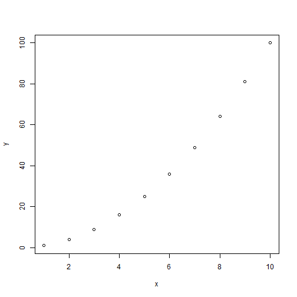

# Title

Hello, [custom_name]! This is a test email with R markdown output.

## Subtitle

This is a paragraph.

| Column 1 | Column 2 |

|----------|----------|

| Value 1  | Value 2  |

## Figure


```r
x <- 1:10

y <- x^2

plot(x, y)
```


